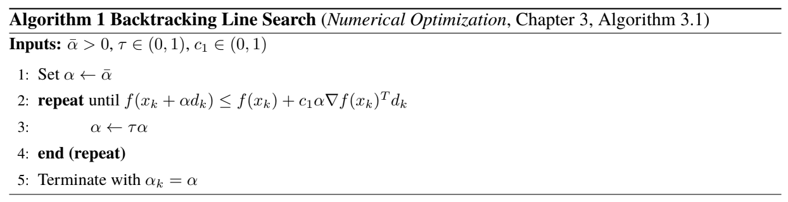
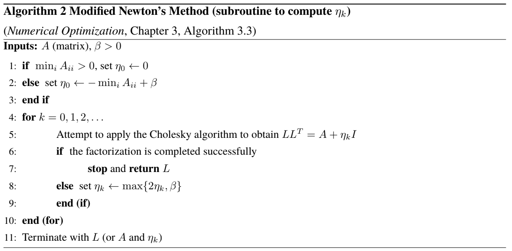
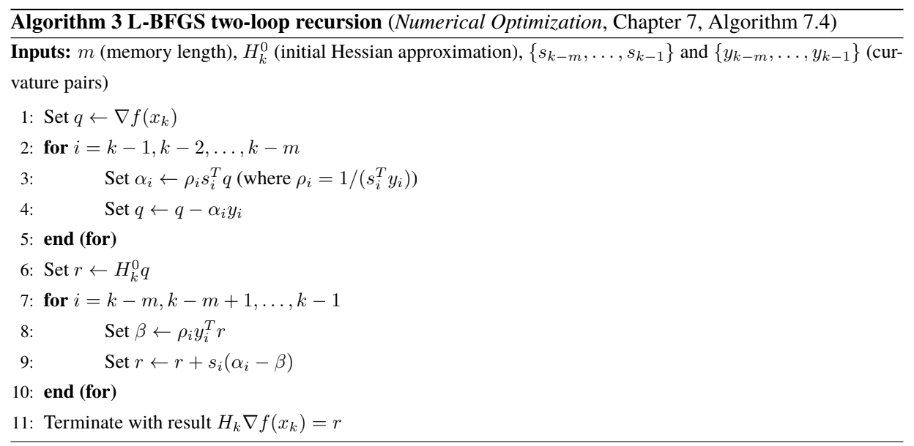

# BFGS: Broyden–Fletcher–Goldfarb–Shanno algorithm
HW3 Pt2 - Gradient Descent, Backtracking Line Search, Modified Newton's Method, BFGS, L-BFGS

We will investigate the performance of several unconstrained optimization methods that we have studied in class on three unconstrained optimization problems.

### Algorithms:
* Gradient Descent with a backtracking line search
* Newton's Method with a backtracking line search and modification
* BFGS ($H_0 = I$; skip update if $s_k^Ty_k$ is not sufficiently positive, i.e., skip if $s_k^Ty_k < \epsilon ||s_k||_2||y_k||_2$);
* L-BFGS (with memory $m \in \{2, 5, 10\}$; $H_k^{(0)} = I$; skip update if $s_k^Ty_k$ is not sufficiently positive).

### Problems:
* Rosenbrock Problem:

$f(x) = (1-w)^2 +100(z-w^2)^2$, where $x = [w$ $z]^T \in R^2$

**Starting point:**
$x_0 =\left[1.2\mbox{ }1.2\right]^T$. 
Note: $x^{\*} = \[w^{\*}$ $z^{\*}\]^T$ $=\[1$ $1\]^T$.

* Function 2:

$f(x) = \sum_{i=1}^3(y_i - w(1-z^i))^2$, where $x = [w \mbox{ } z]^T \in R^2$,

where $y =\left[1.5\mbox{ }2.25\mbox{ }2.625\right]^T$. 

**Starting point:**
  $x_0 = \left[1 \mbox{ }1 \right]^T$. Note: the term involving $z$ takes $z$ to the power of $i$.

* Function 3:

$$f(x) = \frac{exp(z_1)-1}{exp(z_1)+1} + 0.1 exp(-z_1) +\sum_{i=2}^n (z_i-1)^4$$, where $x = \left[z_1\mbox{ }z_2\mbox{ }...\mbox{ }z_n \right]^T \in R^n$.

 
where $n \geq 2$. 

**Starting point:**
$x_0 = \left[\mbox{1 0 ... 0 }\right]^T$ . For this problem, let $n \in \{2, 10, 100, 1000 \}$.

**Constants:**
$\bar{\alpha} =1$ ; $c_1 = 10^{-4}$; $\tau = 0.5$; max_iters = 1000; $\epsilon = 10^{-6}$; $\beta = 10^{-6}$.

#### Termination Conditions:

$||\nabla f(x_k)||_{inf} \leq \epsilon \mbox{max}$ { $||\nabla f(x_0)||_{inf}, 1$ }, or $k <$ max_iters ($k$: iteration counter).

