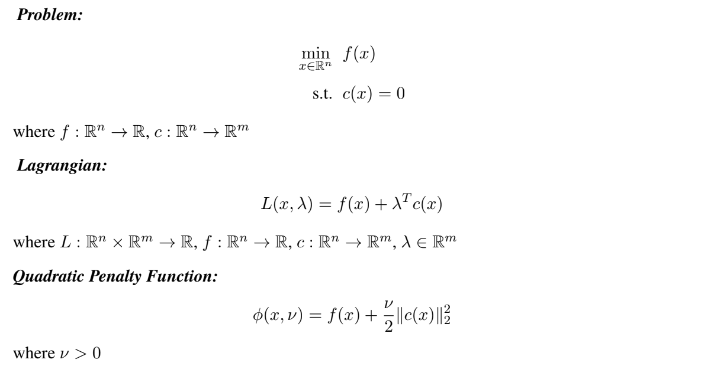
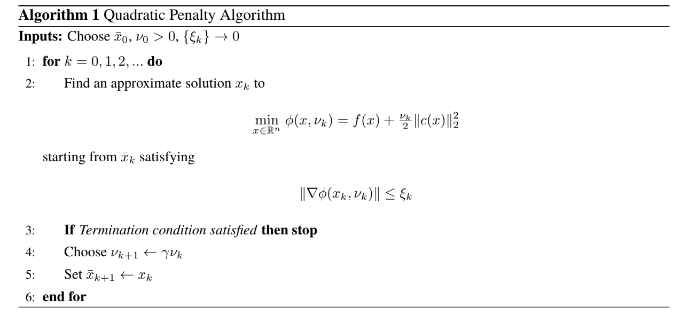
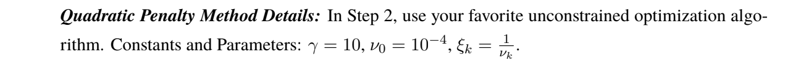
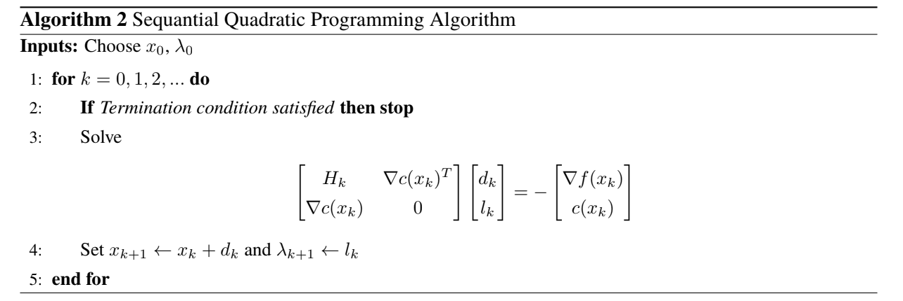
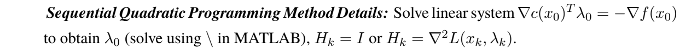

# QP & SQP
HW5 - Quadratic Penalty Methods, Sequential Quadratic Programming Methods

We will investigate the performance of Quadratic Penalty (QP) Methods and Sequential Quadratic Programming (SQP) Methods on equality constrained opti-
mization problems.

### Algorithms:
* Quadratic Penalty Method
* Sequential Quadratic Programming Method

Algorithm Details:

### Problems:

1. *Problem_1*:
$$\mbox{min}_{x\in R^2} x_1+x_2$$
$$x_1^2 + x_2^2 -2 = 0$$

**Starting Point**:
$x_0 = \left[2\mbox{ }2\right]^T$.

**Optimal Solution**:
$x^{\*} = \left[-1\mbox{ }-1\right]^T$

**Details**:
$n=2, m=1$.

2. *Problem_2*:
$$\mbox{min}_{x\in R^2} e^{x_1x_2x_3x_4x_5} - \frac{1}{2}(x_1^3 +x_2^3 + 1)^2$$
$$x_1^2 + x_2^2 +x_3^2 +x_4^2 + x_5^2 -10 = 0$$
$x_2x_3 - 5x_4x_5 = 0$
$x_1^3 +x_2^3 + 1 = 0$

**Starting Point**:
$x_0 = \left[−1.8\mbox{ }1.7\mbox{ }1.9\mbox{ }−0.8\mbox{ }−0.8\right]^T$.

**Optimal Solution**:
$x^{\*} = \left[−1.71\mbox{ }1.59\mbox{ }1.82\mbox{ }−0.763\mbox{ }−0.763\right]^T$

**Details**:
$n=5, m=3$.

### Termination Conditions:

$||\nabla L(x_k, \lambda_k)||_{inf} \leq \epsilon \mbox{max}$ { $||\nabla L(x_0, \lambda_0)||_{inf}, 1$ }
, $||c(x_k)||_{inf} \leq \epsilon \mbox{max}$ { $||c(x_0)||_{inf}, 1$ }
, or $k <$ max_iters ($k$: iteration counter).

